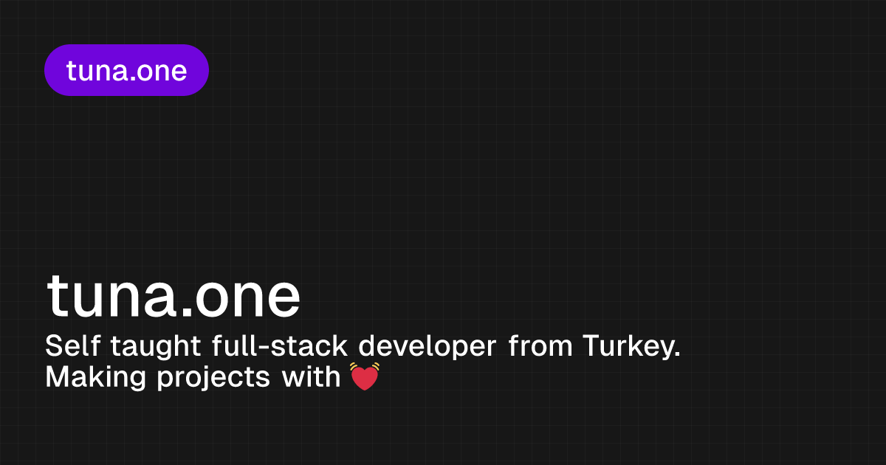

<p>
    
</p>


💫 Welcome to the source code of my personal website, [tuna.one](https://tuna.one)! This project showcases my development journey, including my favorite anime, music, and projects.

## 🛠️ Tech Stack

- ⚛️ **Next.js 14** - Powerful React framework for server-side rendering and static site generation.
- 🎨 **Tailwind CSS** - Utility-first CSS framework for modern, responsive design.
- 🧩 **shadcn/ui** - Pre-built, customizable UI components.
- 📚 **Raindrop API** - Seamless bookmark management and display.
- 📝 **Contentful** - Headless CMS for effortless content management.
- 🎧 **Spotify API** - Displays my recently listened songs.
- 🎮 **Lanyard API** - Shows my live Discord status.
- 🎥 **MyAnimeList API** - Tracks my anime watchlist.

## ✨ Features

- **Real-time Discord status** - View my current Discord status live on the site.
- **Real-time Spotify listening from Discord** - See what I’m listening to on Spotify in real-time.
- **Experiences & personal projects section** - A curated list of my professional experiences and projects.
- **Recently watched animes from MAL** - Displays the latest anime I've watched.
- **Recently listened songs from Spotify** - Check out my recent listening activity.
- **Repositories from GitHub** - Explore my public repositories and code contributions.
- **Blog** - Read my thoughts on development and beyond.
- **Bookmarks with Raindrop** - A collection of my favorite web bookmarks.
- **Dark/Light Theme** - Supports both dark and light themes.

## 🚀 Getting Started

### 📋 Prerequisites

- Ensure you have Node.js and npm installed on your machine.

### 🛠️ Installation

1. **Clone the repository:**

   ```bash
   git clone https://github.com/barbecue/website.git
   cd tuna.one
   ```

2. **Install dependencies:**

   ```bash
   npm install
   ```

3. **Set up environment variables:**
   Copy the `.env.example` file and rename it to `.env.local`. Fill in the required values for each variable. Once completed, you're ready to start your website!

4. **Run the development server:**

   ```bash
   npm run dev
   ```

   Visit [http://localhost:3000](http://localhost:3000) to see it in action! 🎉

## 🤝 Contributing

Contributions are welcome! Let’s make this project even better together! 💪

## 📄 License

This project is licensed under the MIT License. See the [LICENSE](LICENSE) file for details.
